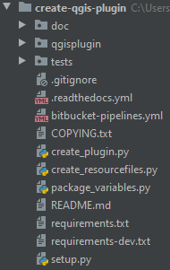

An overview of the project structure
====================================

At first glance, you might be overwhelmed by the sheer number of files for such a small tool.
Let's break it down and get you introduced to all parts. You will notice it is not that bad...

doc: the documentation folder
-----------------------------

Here you will find all the files for building your documentation. It includes configuration files and
content. For example, it includes the code for the page you are reading now.
For more information, see `Part 4 <step4_documenting.html>`_.

qgisplugin: the actual plugin folder
------------------------------------

This is the most important folder in your project. It contains the actual code of your plugin.
For more information, see `Part 1 <step1_code.html>`_ on the code and `Part 2 <step2_ui.html>`_ on the user interface.

tests: test classes for your code
---------------------------------

This folder should contain scripts for unit testing and test data.
For more information, see `Part 3 <step3_testing.html>`_.

other files
-----------

The rest of the files are required for either building or maintaining your plugin.

- **.gitignore** tells git which files to ignore, so they won't clutter your repository.
- **.readthedocs.yml** contains metadata for the documentation hosting platform Read the Docs.
- **bitbucket-pipelines.yml** contains metadata to set up a pipeline on bitbucket.
- **COPYING.txt** contains the license information and should always be distributed with your code.
- The **create_plugin.py** script allows you to build your qgis plugin in one click.
- The **create_resourcefiles.py** allows you to create a resource file for your images in one click.
- **package_variables.py** contains recurring variables, like author name, version number, etc.
- **README.md** contains the basic project information and its content is used by your git page, readthedocs and PyPi.
- **requirements.txt** lists the external packages required to run your python core.
- **requirements_dev.txt** lists all external packages required for development.
- The **setup.py** script allows you to create a python package in one click.

