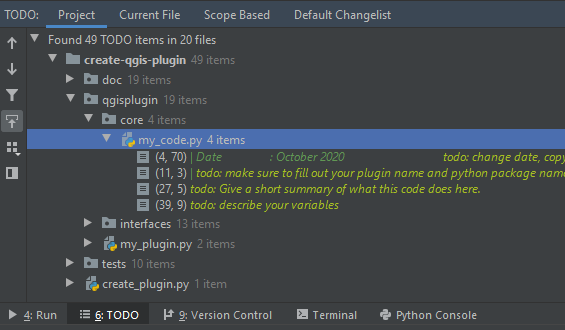

Updating your information
=========================

Before you go public with any product, whether it is the code, the documentation, the python package or the QGIS plugin,
make sure you update a few key pieces of information throughout the code.

First of all, there are the variables in the file *package_variables.py*, like the plugin name, author, email, ...:

.. code-block:: python

    short_name = 'python-package'
    qgis_plugin_name = 'Create QGIS Plugin'
    read_the_docs_name = 'CreateQGISPlugin'
    sphinx_title = 'How to create a QGIS plugin'

    author = 'Ann Crabbé'
    author_email = 'acrabbe.foss@gmail.com'
    author_copyright = '© 2020 by Ann Crabbé'
    short_version = '1.0'
    long_version = '1.0.1'

    [...]

Also make sure you update all the code headers and replace our copyright and contact information with your own:

.. code-block:: python

    """
    | ----------------------------------------------------------------------------------------------------------------------
    | Date                : October 2020
    | Copyright           : © 2020 by Ann Crabbé
    | Email               : acrabbe.foss@gmail.com
    | Acknowledgements    : Based on 'Create A QGIS Plugin' [https://bitbucket.org/kul-reseco/create-qgis-plugin]
    |                       Crabbé Ann and Somers Ben; funded by BELSPO STEREO III (Project LUMOS - SR/01/321)
    |
    | This file is part of the [INSERT PLUGIN NAME] plugin and [INSERT PYTHON PACKAGE NAME] python package.
    |
    | This program is free software: you can redistribute it and/or modify it under the terms of the GNU General Public
    | License as published by the Free Software Foundation, either version 3 of the License, or any later version.
    |
    | This program is distributed in the hope that it will be useful, but WITHOUT ANY WARRANTY; without even the implied
    | warranty of MERCHANTABILITY or FITNESS FOR A PARTICULAR PURPOSE.  See the GNU General Public License for more details.
    |
    | You should have received a copy of the GNU General Public License (COPYING.txt). If not see www.gnu.org/licenses.
    | ----------------------------------------------------------------------------------------------------------------------
    """

You will find *todo* statements all over the project. These indicated parts of the code or documentation that
should be updated by you. To locate all of them easily, check the *todo* tab in PyCharm:

