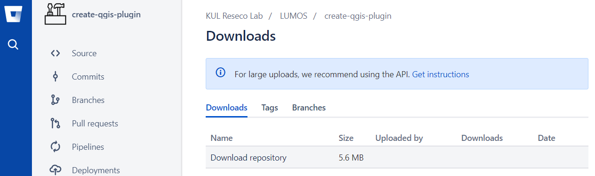
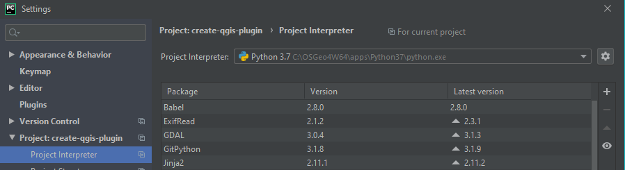
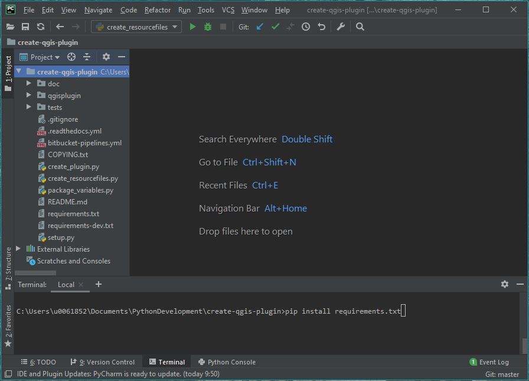
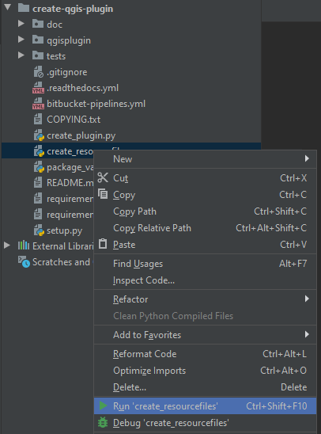
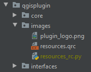

Download the project and set up your environment
================================================

For issues, bugs, proposals or remarks, visit the
`issue tracker <https://bitbucket.org/kul-reseco/create-qgis-plugin/issues?status=new&status=open>`_.

Step 1: Download the repository
-------------------------------

You can find the `repository here <https://bitbucket.org/kul-reseco/create-qgis-plugin>`_. You can download
the entire repository from the `downloads page <https://bitbucket.org/kul-reseco/create-qgis-plugin/downloads/>`_.

**We recommend you use a versioning system** like bitbucket, github or gitlab:

- create an account;
- create your own repository;
- clone it to your local system;
- copy our code into that folder.

From there, you can start changing the code and commit changes locally and/or push them to your remote system.

Now you are safe from system crashes! Not familiar with git? A lot of easy tutorials for starters are out there.

Step 2: Choose an IDE
---------------------

Many **integrated development environments (IDE)** exists, like Microsoft Visual Studio, Spyder or Eclipse.
An IDE supports you in writing, compiling and debugging your code, by helping you control your environment.
Feel free to use the IDE of your choice, but keep in mind that set-ups tend to differ from IDE to IDE.

We are using **PyCharm**, as it is very powerful:

- Strong Python support;
- An intelligent editor that highlights incorrect syntax, has automated code-completion and docstring support;
- Smart code navigation allows you to jump to declarations in one click and helps your locate all usages of a function;
- Safe refactoring of code helps you to rename/delete variables and functions;
- Build-in debugging and testing;
- Build-in git (or SVN or Mercurial) support.

These two steps you will always have to do:

- Make sure your IDE used the correct python interpreter;
- Update your environmental variables, so that your interpreter knows where to look for qgis and osgeo packages.

Scroll down for an explanation on how to do this in PyCharm.

Step 3: Set your environmental variables
----------------------------------------

To run QGIS from python, your interpreter should know **where to go and look for the right packages**.
Since these are no standard python packages, you will have to update your environmental variables.

You could try to do it manually, but we advise against it, as you could actually interfere with
other processes on your computer and by installing new software your changes could be overruled.

The easiest way is to change them *on the fly* when you open your IDE:

- Create a batch file (e.g. *pycharm.bat*). It basically is a script with terminal commands;
- Copy/paste the code below;
- Lines with double colons (::) are comments;
- Edit the first two lines of code: they are specific to your QGIS installation;
- Save the file.

Now you can double click this batch file: Pycharm will open with in the background correct environmental variables.

.. code-block:: batch

    ::QGIS installation folder
    set OSGEO4W_ROOT=C:\OSGeo4W64
    set QGIS_PLUGINPATH="C:\Users\[...]\AppData\Roaming\QGIS\QGIS3\profiles\default\python\plugins"

    ::set defaults, clean path, load OSGeo4W modules (incrementally)
    call %OSGEO4W_ROOT%\bin\o4w_env.bat
    call qt5_env.bat
    call py3_env.bat

    ::lines taken from python-qgis.bat
    set QGIS_PREFIX_PATH=%OSGEO4W_ROOT%\apps\qgis
    set PATH=%QGIS_PREFIX_PATH%\bin;%PATH%

    ::make PyQGIS packages available to Python
    set PYTHONPATH=%QGIS_PREFIX_PATH%\python;%PYTHONPATH%

    :: GDAL Configuration (https://trac.osgeo.org/gdal/wiki/ConfigOptions)
    :: Set VSI cache to be used as buffer, see #6448 and
    set GDAL_FILENAME_IS_UTF8=YES
    set VSI_CACHE=TRUE
    set VSI_CACHE_SIZE=1000000
    set QT_PLUGIN_PATH=%QGIS_PREFIX_PATH%\qtplugins;%OSGEO4W_ROOT%\apps\qt5\plugins

    ::enable/disable QGIS debug messages
    set QGIS_DEBUG=1

    ::PyCharm executable
    set IDE="C:\Program Files\JetBrains\PyCharm Community Edition 2019.2.3\bin\pycharm64.exe"
    start "Start your IDE aware of QGIS" /B %IDE% %*

Step 4: Select the correct Python interpreter
---------------------------------------------

You probably will have, knowingly or unknowingly, installed many python versions on your system: stand alone, inside
your QGIS installation, one for Microsoft Visual Studio, maybe when working in Spyder before, etc.

**You have to choose the interpreter that comes with the QGIS installation.** Usually it can be found here: ::

     QGIS installation folder > apps > python37 > python.exe

Setting the python interpreter is straightforward:

- PyCharm will complain to you and you won't be able to run your code. Just follow the link in the warning message.
- Or go to File > Settings > Project > Project Interpreter.

Step 5: Access your git system from within your IDE
---------------------------------------------------

Add the git executable to your path by adding the following line of code to your batch file from step 3. Paste it
*before* the last line of code where you call the program itself:

.. code-block:: batch

    set PATH=%PATH%;C:\Users\[...]\AppData\Local\Programs\Git\bin

Step 6: Install python packages
-------------------------------

The files *requirements.txt* and *requirements-dev.txt* contain all external packages that are
important to your project. You can install them from within PyCharm:

- Go to the terminal window at the bottom of your project
- Type the following code:

  .. code-block:: batch

    $ pip install -r requirements.txt
    $ pip install -r requirements-dev.txt

Step 7: Build your resources file
---------------------------------

If you want to access images from within python code (e.g. to add your logo to the GUI), you need a resource file.

In the *images* folder of your plugin, you will find one or more images, and a file named *resources.qrc*. This file
contains a list of images, and where to find them, like this:

.. code-block:: xml

    <RCC>
        <qresource>
            <file alias="plugin_logo">plugin_logo.png</file>
        </qresource>
    </RCC>

Here, you can add a reference your own images if you would like:

.. code-block:: xml

    <RCC>
        <qresource>
            <file alias="plugin_logo">plugin_logo.png</file>
            <file alias="new">my_new_image.png</file>
        </qresource>
    </RCC>

This file is not enough. It must be translated into a python file. Luckily, we made that part easy for you:

- Right-click on the file named *create_resourcefiles.py*.
- Choose *Run*.

This output should appear on the console ::

    Recourse file 'C:\Users\[...]\create-qgis-plugin\qgisplugin\images\resources_rc.py' created.

And a new file should be added to the *image* folder:

We chose not to store this *resources_rc.py* file on git
(see `the next page <getting_started.html>`_ for an explanation on *.gitignore*).
That is why this step was necessary.

Step 8: Start coding!
---------------------

The next chapters explain one by one how to build your code, interfaces, test classes, some documentation and
of course the plugin itself!

Before you upload your code to an online platform, make sure you follow the steps
`here <going_public.html>`_ in order not to have incorrect licensing information or author identification.

