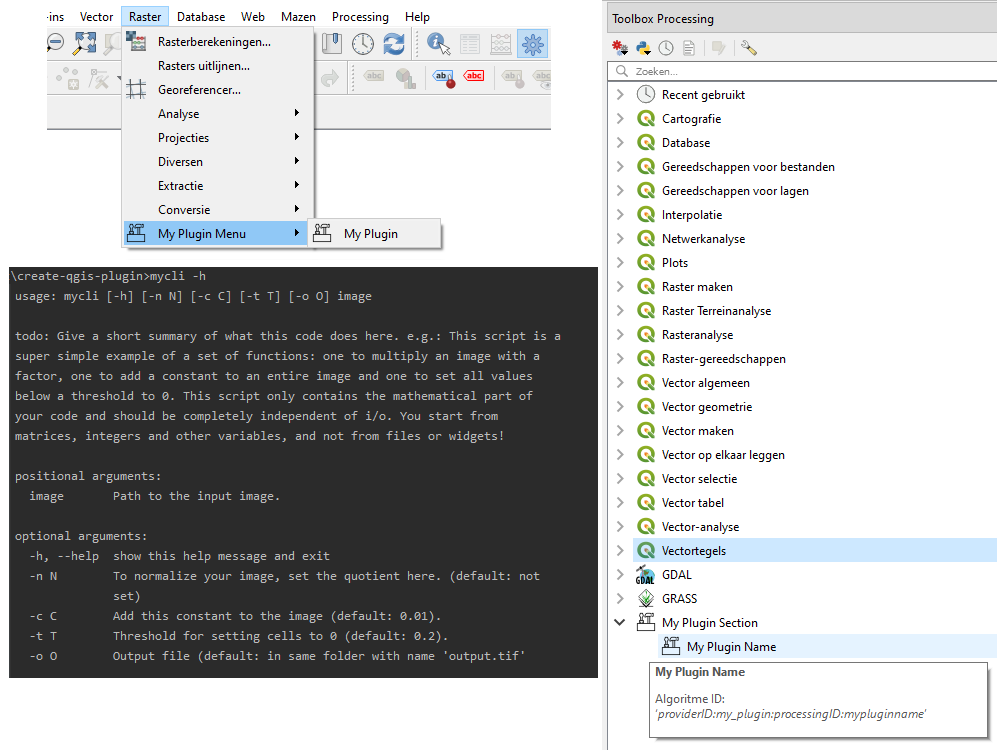

Build a user interface
======================

Several ways exist to interact with the user: you can build a GUI from scratch. This is the most labour intensive
but has the highest flexibility. Much easier is to have your GUI built automatically by the processing framework.
And a third option is to write a command line interface.

Before you upload your code to an online platform, make sure you follow the steps
`here <going_public.html>`_ in order not to have incorrect licensing information or author identification.

.. toctree::
   :maxdepth: 1

   step2a_gui
   step2b_processing
   step2c_cli

