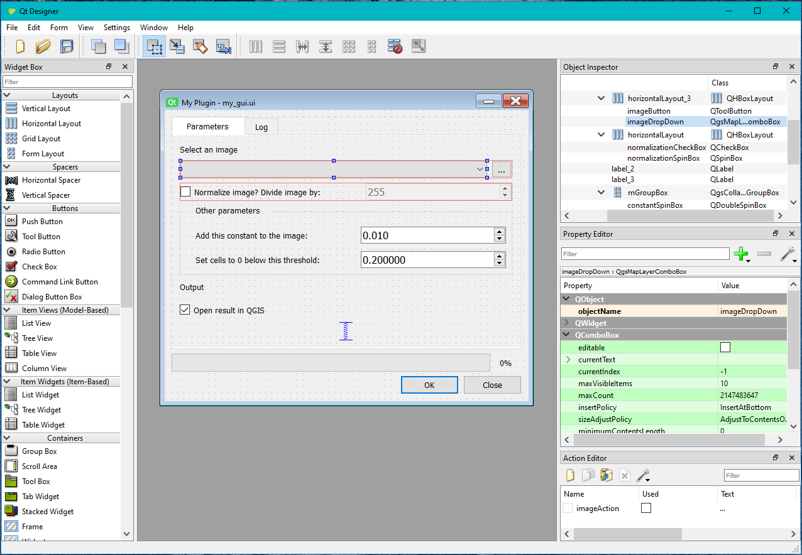
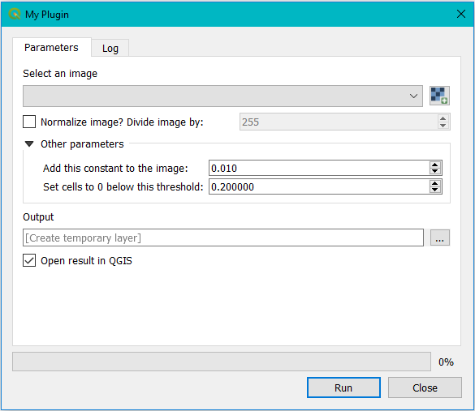

Build a GUI from scratch
------------------------

Before you get started on building your own GUI, it might be worth your while to go on YouTube and watch a few
videos on PyQt and PyQt for QGIS. That way you are more familiar with the concepts provided here.

- Qt is a library to build widgets. PyQt is the Python package with Qt bindings.
  This library is independent from QGIS but QGIS uses it.
- Next to the Qt library, some QGIS specific widgets also exist.

To get started, we need two files::

    > qgis plugin folder
        > images
        > interfaces
            my_gui.py
            my_gui.ui

The *.ui* file is an XML that describes the structure of your GUI.
Do not try and edit it directly. You can open it in *Qt Designer*. This program is shipped
with your QGIS installation and can be found under *QGIS installation folder > apps > Qt5 > bin > designer.exe*
(see image below).

The the *.py* file connects the python code to the widgets found in the *.ui* file.

You can simply start from the GUI we have provided and edit it to make it suit your needs.
Before you do, make sure you understand how all widgets work, and how they are connected with the code.

We give some important pointers here:

1. *Qt Designer* can only do so much. Some properties of your GUI should be set with code.
   For example, our GUI has a QComboBox to select an image from the QGIS table of contents
   and a QButton to look for an image on file.

   .. image:: images/gui_select_image.PNG
      :width: 80%
      :align: center

   In the code snippet below, we make sure that (1) only valid raster layers can be selected;
   (2) the function *_choose_image* is called when the user chooses a layer from the QComboBox;
   (3) the function *_browse_for_image* is called when the user presses the QButton:

   .. code-block:: python

       excluded_prov = [p for p in QgsProviderRegistry.instance().providerList() if p not in ['gdal']]
       self.imageDropDown.setExcludedProviders(excluded_prov)
       self.imageDropDown.setFilters(QgsMapLayerProxyModel.RasterLayer)
       self.imageDropDown.layerChanged.connect(self._choose_image)
       self.imageAction.triggered.connect(self._browse_for_image)
       self.imageButton.setDefaultAction(self.imageAction)

2. In order to write output to the log screen in our widget, we created the *log* function.
   This function sends the text it receives to the *logBrowser* widget in our *.ui*.
   So instead of using *print()* statements, we now use *self.log()*.

   .. code-block:: python

       def log(self, text: str):
           # append text to log window
           self.logBrowser.append(str(text) + '\n')
           # open the widget on the log screen
           self.tabWidget.setCurrentIndex(self.tabWidget.indexOf(self.tab_log))

   It is this function, that is passed down to the core, in order to catch info and/or error messages:

   .. code-block:: python

       result = MyCode([...]).execute([...], set_progress=self.progressBar.setValue, log=self.log)

   .. image:: images/gui_log.PNG
      :width: 60%
      :align: center

3. In a similar way the *setValue* function of the QProgressBar is passed down to the core (see code above).

4. To run your script without having to call it from a test class or open it in QGIS itself,
   you can simply add the following to the bottom of your script:

   .. code-block:: python

       def _run():
           from qgis.core import QgsApplication
           app = QgsApplication([], True)
           app.initQgis()
           widget = MyWidget()
           widget.show()
           app.exec_()

       if __name__ == '__main__':
           _run()

   And then press *Run* or *Debug*:

   .. image:: images/gui_run.PNG
      :width: 50%
      :align: center

The QGIS plugin looks like this:

