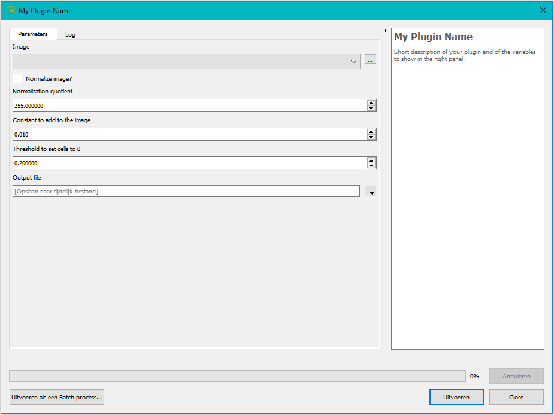

Use the processing toolbox to have QGIS build the plugin for you
----------------------------------------------------------------

You can use the QGIS Processing framework to have a plugin built **automatically**. This has a few advantages and
disadvantages:

- [+] No worries about your widgets and/or lay-out. That is all taken care of in the background.
- [+] Your plugin can be executed in a batch process.
- [+] Your plugin can be part of the model builder.
- [-] You have less flexibility in placement of your widgets.
- [-] The widgets cannot interact dynamically.
- [-] Not possible to add to the menu bar. Your plugin can only be part of the processing toolbox.

Therefore it depends on the algorithm and the level of user interaction what is the best fit. You can always create
both like we did.

Again you need two files: ::

    > qgis plugin folder
        > images
        > interfaces
            my_plugin_processing.py
            my_plugin_provider.ui

Please analyze the scripts closely. There are a lot of obligated fields that are easy enough to
understand like the name, display name, icon and helper string.
All these fields are also accompanied with help in the documentation.

Two very important functions are *initAlgorithm* and *processAlgorithm*.

*initAlgorithm* describes all parameters that should be added to the widget: raster layers, numbers, booleans, ...
Here you can specify the description of your parameter, a default value, min or max for numerical input, etc.
Each input type has its own Qgs definition: QgsProcessingParameterBoolean, QgsProcessingParameterNumber, etc.

.. code-block:: python

    # Select a raster layer
    self.addParameter(QgsProcessingParameterRasterLayer(
        name=self.INPUT, description=self.tr('Image'))
    )

    # Checkbox
    self.addParameter(QgsProcessingParameterBoolean(
        name=self.NORMALIZE, description=self.tr('Normalize image?'), defaultValue=False)
    )

    # Numerical input
    self.addParameter(QgsProcessingParameterNumber(
        name=self.NORMALIZATION_VALUE, description=self.tr('Normalization quotient'), defaultValue=255,
        minValue=1, maxValue=1000000000, type=1)
    )

    # Select output file
    self.addParameter(QgsProcessingParameterFileDestination(
        name=self.OUTPUT, description=self.tr('Output file'))
    )

*processingAlgorithm* is the function where you check all input parameters, transform them to the correct format
and then call your core functionality.

.. code-block:: python

    def processAlgorithm(self, parameters, context, feedback):
        """
        Here is where the processing itself takes place.
        """
        # Read input values
        image_path = self.parameterAsRasterLayer(parameters, self.INPUT, context).source()
        image, metadata = import_image(image_path)
        normalize = self.parameterAsBoolean(parameters, self.NORMALIZE, context),
        quotient = self.parameterAsDouble(parameters, self.NORMALIZATION_VALUE, context)

        # Call the core function
        result = MyCode(
            image=image,
            normalize=normalize,
            quotient=quotient
        ).execute(
            constant=self.parameterAsDouble(parameters, self.CONSTANT, context),
            threshold=self.parameterAsDouble(parameters, self.THRESHOLD, context),
            set_progress=feedback.setProgress,
            log=feedback.pushInfo
        )
        result = result * quotient if normalize else result
        feedback.setProgress(100)

        # Write output to file
        output_path = self.parameterAsFileOutput(parameters, self.OUTPUT, context)
        output_path = write_image(file_path=output_path, image=result, projection=metadata['projection'],
                                  geo_transform=metadata['geo_transform'])

        feedback.pushInfo("Written to file: {}".format(output_path))

        # Add layer to your QGIS project
        context.addLayerToLoadOnCompletion(output_path,
            QgsProcessingContext.LayerDetails(name='Processed Image', project=context.project()))

        return {'Processed Image': output_path}

