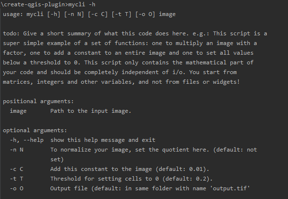

Create a command line interface for working outside of QGIS
-----------------------------------------------------------

Building a command line interface is not that difficult, but you should execute it very carefully: it is very
sensitive to typos.

Your script will have three parts:

1. A function that describes all mandatory and optional arguments.
   The code below shows 3 arguments, of which only the first one is mandatory:

   .. code-block:: python

       parser.add_argument('image', type=str, help='Path to the input image.')
       parser.add_argument('-t', type=float, default=0.2, help='Image threshold (default: 0.2).')
       parser.add_argument('-o', type=str, help="Output file (default: 'output.tif'")

2. A function to run the code based on the parsed arguments. This function is where you check all input parameters,
   transform them to the correct format and then call your core functionality.

3. A main function:

   .. code-block:: python

    def main():
        parser = create_parser()
        run_code(parser.parse_args())

The tricky part is to get the command line function installed. The way to do this is to first set the
function name in the *setup.py* file and point to the main function in your code:

  .. code-block:: python

     entry_points={
         'console_scripts': [
             'myFunctionName=qgisplugin.interfaces.my_cli:main'
         ]
     }

And then install your code as a python package. As long as you are still debugging, you can install it in
*develop mode*: the files are not actually installed in the *site-packages* folder, but your system recognizes them
as if it were. Go to the terminal window in your IDE and type:

.. code-block:: batch

    $ python setup.py develop

From now on, you can call your package from the command line in the terminal like this:

.. code-block:: batch

    $ myFunctionName images/sentinel2/august1.tif -t 0.01 -o images/results/august1_mask.tif

To get more info you use the *--help* or *-h* argument:

See `Part 5 <step5_python_package.html>`_ on how to build python packages for distribution.

