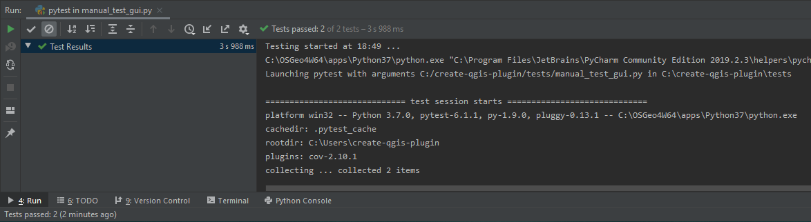

Testing your code with unit tests
=================================

Debugging and testing is very important when coding. Your IDE helps you a great deal by providing a debugger.

In addition, you should write test classes with so called *unit tests*: each *unit test* tests one
aspect of your code. For example it runs your program with all default inputs and checks that the output is correct.
Or it checks the behaviour of your CLI when the user inputs an invalid file.
Or it checks that a specific button does what it is supposed to.
Or ...

The point of writing these unit tests, is that you can run them quickly and frequently to check that your program is
still doing what it is supposed to and does not break, even after you make some edits.

First you need test classes and test data. A class looks something like this:

.. code-block:: python

    import os.path as path
    import unittest

    from qgisplugin.core.my_code import MyCode
    from qgisplugin.interfaces import import_image

    DATA_FOLDER = path.join(path.dirname(__file__), "data")

    class TestCore(unittest.TestCase):

        def test_core(self):
            # input
            image, _ = import_image(path.join(DATA_FOLDER, 'image.tif'))

            # run code
            result = MyCode(image=image, normalize=True, quotient=255).execute(constant=0.01, threshold=0.2)

            # evaluate
            self.assertEqual(len(result), len(image))
            # todo it makes more sense to compare the actual content of the array, we leave this up to you

Next, you need a quick way to run your test classes. You have a few options.

You can run each class **manually**, if you only have a few: just right-click on each script and then click *Run*.
You will get a summary on the console looking like this:

You can run **all test classes at the same time with PyTest**. Run the following line of code in the terminal:

.. code-block:: batch

  python -m pytest --cov qgisplugin.core --cov qgisplugin.interfaces --cov-report term-missing tests

This command orders pytest to check all python scripts in the folder *tests* whose name begin with *test_* and run the
unit tests within them.
Alongside the failure or success rate of each test class, you get some statistics on the *coverage* of all scripts
that are in the folders *qgisplugin.core* and *qgisplugin.interfaces* (see parameter *--cov*).
This coverage tells us what % of the code is covered by the test classes. The parameter *term-missing* then
adds more information: the lines of code that have not been tested by our test classes.
It is difficult to reach 100 % coverage, however this helps you detect vulnerabilities in your test regime.

.. code-block:: batch

     =========================== test session starts =============================
     platform win32 -- Python 3.7.0, pytest-6.1.1, py-1.9.0, pluggy-0.13.1
     rootdir: C:\create-qgis-plugin
     plugins: cov-2.10.1
     collected 5 items

     tests\test_cli.py ..               [ 40%]
     tests\test_core.py .               [ 60%]
     tests\test_gui.py ..               [100%]

     ----------- coverage: platform win32, python 3.7.0-final-0 ------------------
     Name                                            Stmts   Miss  Cover   Missing
     -----------------------------------------------------------------------------
     qgisplugin\core\__init__.py                         0      0   100%
     qgisplugin\core\my_code.py                         26      0   100%
     qgisplugin\interfaces\__init__.py                  32      8    75%   35, 45-46, 55-60
     qgisplugin\interfaces\my_cli.py                    33      3    91%   73-74, 78
     qgisplugin\interfaces\my_gui.py                   117     36    69%   94-108, 122-133, 145, 165,
                                                                           172-178, 200-207, 211
     qgisplugin\interfaces\my_plugin_processing.py      49     49     0%   2-148
     qgisplugin\interfaces\my_plugin_provider.py        13     13     0%   2-44
     -----------------------------------------------------------------------------
     TOTAL                                             270    109    60%

     =========================== 5 passed, 15 warnings in 6.18s ====================

You can also have these test run **automatically by your versioning system**.
For example Bitbucket has a continuous development implementation named *pipelines*.

In order to make use of this option, you need the *bitbucket-pipelines.yml* yaml file.
With the following implementation the test suite is run with each commit to the repository:

.. code-block:: yaml

        image: qgis/qgis

        definitions:
          steps:
            - step: &Test-step
                script:
                  - python -m pip install -r requirements.txt
                  - python -m pip install -r requirements-dev.txt
                  - python setup.py develop
                  - apt-get update
                  - apt-get install -y xvfb
                  - apt-get install -y wget
                  - apt-get install -y unzip
                  - Xvfb :1 -screen 0 1024x768x16 &> xvfb.log  &
                  - ps aux | grep X
                  - DISPLAY=:1.0
                  - export DISPLAY
                  - python create_resourcefiles.py
                  - python -m pytest --cov qgisplugin.core --cov qgisplugin.interface --cov-report term-missing tests

        pipelines:
          branches:
            default:
              - step: *Test-step
            staging:
              - step: *PYPI-step

.. note::

  The bitbucket pipeline mechanism seems to have trouble with testing the GUI, as it uses a timer to open and
  close widgets. Therefore we have taken it out of the equation by prefixing the script with *manual_*.
  This test will therefore not be part of any automated testing, but you can run it manually now and then to check
  that your GUI is still functioning properly.

Before you upload your code to an online platform, make sure you follow the steps
`here <going_public.html>`_ in order not to have incorrect licensing information or author identification.

