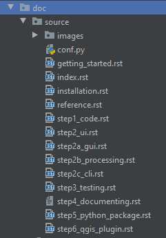
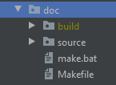

Write project documentation
===========================

Again it is best to familiarize yourself a little bit with the reStructuredText, Markdown, Sphinx and Read the Docs.
You do not need to be a pro in any of these fields to build something that looks descent. But it might
be overwhelming in the beginning.

**You could start from scratch yourself. But we made it easy for you and presented this template for you.
No need for you to install packages, configure sphinx or anything like that: all you have to do is deliver content.**

The documentation folder looks like this:

- The *images* folder contains all images.
- The *conf.py* file contains configuration settings, but should not concern you at this point.
- The *index.rst* file is the first page the user will see, but all other *.rst* files contain the rest of the content.
  These pages are written as *reStructuredText*.

To write meaningful documentation, **please try to stick more or less to the following structure**:

    +-------------------------------+
    | 1. Some context on the plugin |
    | 2. Installation instructions  |
    | 3. A user manual              |
    | 4. One or more exercises      |
    | 5. The API                    |
    +-------------------------------+

Some concepts of reStructuredText
---------------------------------

Have a look at *index.rst* to get familiarized with some concepts.

**We always choose to have Section 1 (context) be identical to the README.md file content**.
That way we make sure not to duplicate any information that might be lost or forgotten.

Our *README.md* contains information on the plugin, citations and acknowledgments, license, sponsors etc.:
all information you want the user to know upfront.

To copy the information, use the *include* directive::

  .. include:: ../../README.md

*README.md* is written in the *Markdown* format which is not entirely compatible with *reStructuredText*.
Best keep it simple. Luckily headers work the same way.

.. warning::
    Try not to mess with the *index.rst* and *README.md* structure:
    it is designed in such a way to have a nice lay-out of your HTML pages
    and at the same time have a good table of context and structure of the PDF version of your documentation.
    This is not evident when you start including other files like we do here.

**You can build a table of contents using the 'toctree' directive**::

  .. toctree::
     :hidden:

     installation
     getting_started
     step1_code
     ...

The *:hidden:* parameter is to not have it duplicated on the *index.html* page.

**Hyperlinks** are created like this::

  `issue tracker <https://bitbucket.org/kul-reseco/create-qgis-plugin/issues>`_

**Images** are added like this::

  .. image:: images/gui_empty.PNG
     :width: 40 %
     :align: center

Another important part of documentation is **sharing your API**. This is done like this for a python class::

    .. automodule:: qgisplugin.core.my_code
        :members:
        :undoc-members:
        :show-inheritance:

And like this for a command line interface::

    .. argparse::
       :module: qgisplugin.interfaces.my_cli
       :func: create_parser
       :prog: mycli

Just have a look at the rest of the documentation for more inspiration.

Building your documentation locally
-----------------------------------

To build your documentation locally, all you have to do is run this line of code in the terminal::

    $ cd doc
    $ make html

A new folder will appear next to the source folder:

To test your HTML pages, go to *doc* > *build* > *html* > *index.html* and right-click on the file. You will see an
option to open the file in a browser. Your documentation will appear in your web browser the same way they would
on the Read the Docs platform.

You will notice your browser tab has an **icon (favicon)**. To change this do the following:

- If you do not want to touch *conf.py*, copy your icon to the *images* folder and name it "plugin_logo.PNG".
- Or you can find (and change) the reference to this icon in the *conf.py* file like this:

    .. code-block:: python

        html_favicon = 'images/plugin_logo.PNG'

Building your documentation on Read the Docs
--------------------------------------------

Before you upload your documentation to an online platform, make sure you follow the steps
`here <going_public.html>`_ in order not to have incorrect licensing information or author identification.

Then go to readthedocs.org to make an account and follow the easy steps to link your readthedocs account with
your online repository. Just make sure you choose a clear name for your documentation and make sure it is
the same as in your *package_variables.py* file.

And that is it! Updates will now happen automatically.

