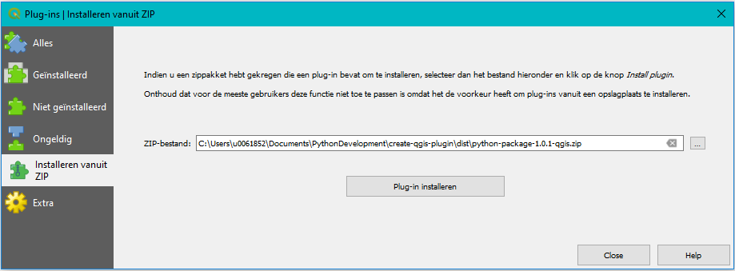
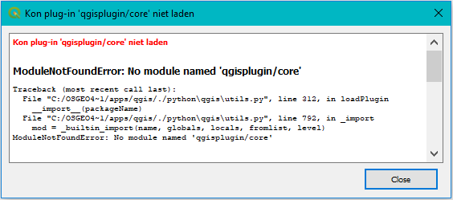
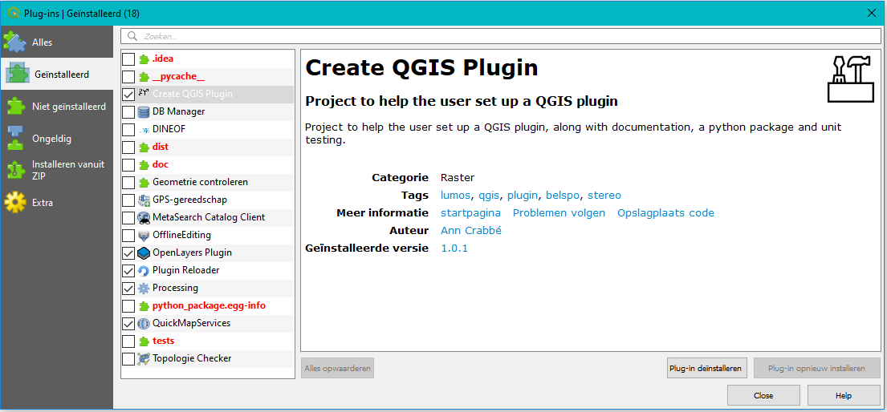
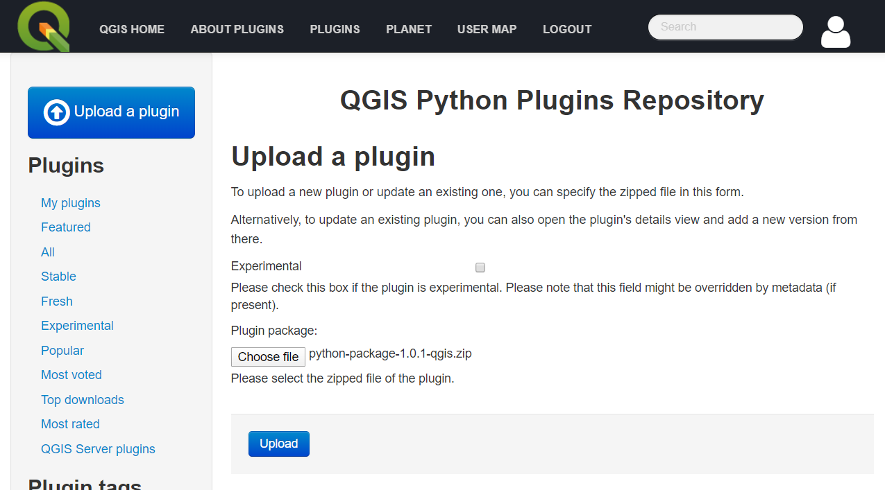
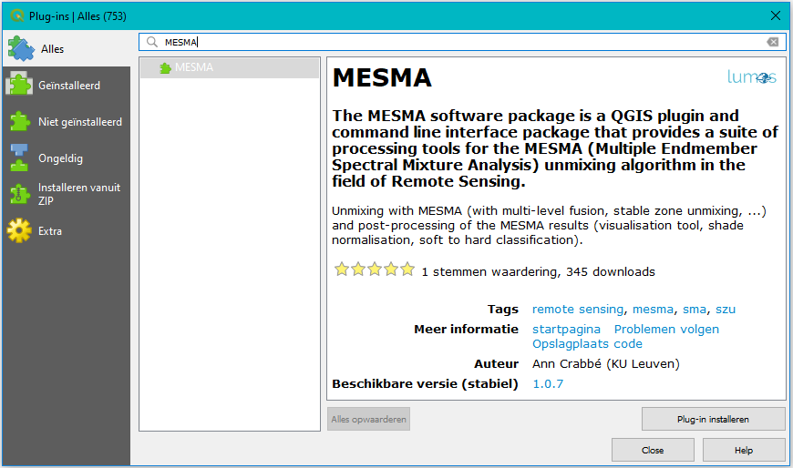
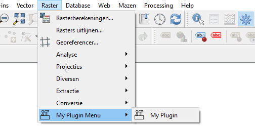
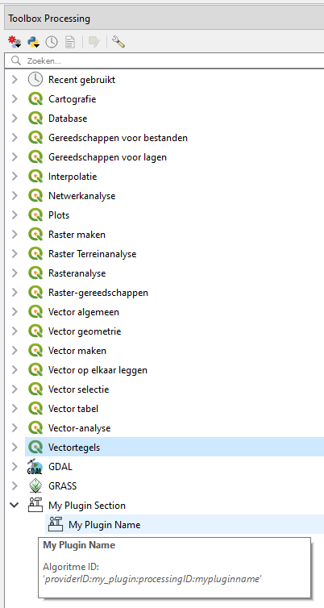

Build your QGIS plugin
======================

The central files for building your plugin are *my_plugin.py* and *__init__.py* next to it.
These are the scripts where you add your plugin to the menu bar or processing toolbox (or both).

Have a look at the code
-----------------------

.. code-block::

    def __init__(self, iface):
        self.iface = iface
        self.plugin_dir = path.dirname(__file__)
        self.actions = []
        self.provider = None

        # Add an empty menu to the Raster Menu
        self.main_menu = QMenu(title='My Plugin Menu', parent=self.iface.rasterMenu())
        self.main_menu.setIcon(QIcon(':/plugin_logo'))
        self.iface.rasterMenu().addMenu(self.main_menu)

    def add_action(self, icon_path: str, text: str, callback: callable, enabled_flag: bool = True,
                   status_tip: str = None, whats_this: str = None, parent: QWidget = None) -> QAction:

        icon = QIcon(icon_path)
        action = QAction(icon, text, parent)
        action.triggered.connect(callback)
        [...]
        self.main_menu.addAction(action)
        self.actions.append(action)

        return action

    def initGui(self):
        self.add_action(icon_path=':/plugin_logo',
                        text='My Plugin',
                        callback=partial(self.run, 'my_plugin'),
                        parent=self.iface.mainWindow())

        self.provider = MyProcessingProvider()
        QgsApplication.processingRegistry().addProvider(self.provider)

    def unload(self):
        self.iface.rasterMenu().removeAction(self.main_menu.menuAction())
        QgsApplication.processingRegistry().removeProvider(self.provider)

    @staticmethod
    def run(name: str):
        if name == 'my_plugin':
            widget = MyWidget()
        else:
            return
        widget.show()
        widget.exec_()

The function *initGui* is called upon installation of your plugin. At this point you add an "action" (= button)
to your freshly created menu and you add your processing provider to the QGIS Processing Registry.

When you uninstall your app, the function *unload* is called. It is important to remove your menu item and
processing provider completely at this point.

Notice how upon action, the widget is called from a separate function named *run*. This design is intentionally.
If you would call your widget directly with the callback parameter, your code is activated as soon as
your install your plugin or later, as soon as QGIS boots. This might cause unwanted processing power overhead.

Create your QGIS Plugin zip file
--------------------------------

Before you upload your QGIS plugin to an online platform, make sure you follow the steps
`here <going_public.html>`_ in order not to have incorrect licensing information or author identification.

Building a QGIS is a bit peculiar. For example it is important to have a *metadata.txt* file with the
correct content. Next, you are working under the GNU General Public License and you should make sure you
adhere to their specifications too:

- You need to add the *COPYING* file to your code.
- Each script should contain the license information and a copyright disclaimer.

We have taken care of this for you:

- The license/copyright information can be found at the top of each script and should be edited by you
  to include the correct information.
- The COPYING file is part of this distribution and can not be removed.
- The metadata file is written automatically based on the information provided by you in the
  file *package_variables.py*.

How to build your plugin?

- Right-click on the file *create_plugin.py*.
- Click *Run*.

That is it! After this script has run successfully, you will find the following new files:

- *qgisplugin* > *images* > *resources_rc.py* (if you would not have done this already)
- *qgisplugin* > *metadata.txt*
- *dist* > *python-package-x.x.x-qgis.zip*

This last file is your QGIS plugin.

Installing your QGIS Plugin from file
-------------------------------------

Your QGIS plugin can now be installed from file.

Do not be alarmed if you get an error message like this:

This happens because QGIS does not recognize the folder structure. But the plugin is installed regardless.
Just turn your plugin once off and on in the *installed plugins* menu and you will be fine:

Uploading your QGIS plugin to the official QGIS Plugin Repository
-----------------------------------------------------------------

You can also upload your plugin to the official QGIS repository. In order to do that, you need an OSGEO account.
Go to https://plugins.qgis.org/plugins/my and login with your account.

Here you can upload your zip file. A quick check is done on the content of your zip folder. If your metadata file
is missing or corrupt, you will get an error message for example.

Then your plugin is checked manually by someone from the QGIS team and approved if they find that all conditions are
met. Keep an eye on your issue tracker, as this is the first place they will post any comments, questions or problems.

Once your plugin has been approved, anyone can find and install it from within QGIS by typing the name or any
of the keywords in the plugin search bar:

After installation, find your plugin in the menu or processing toolbox:

